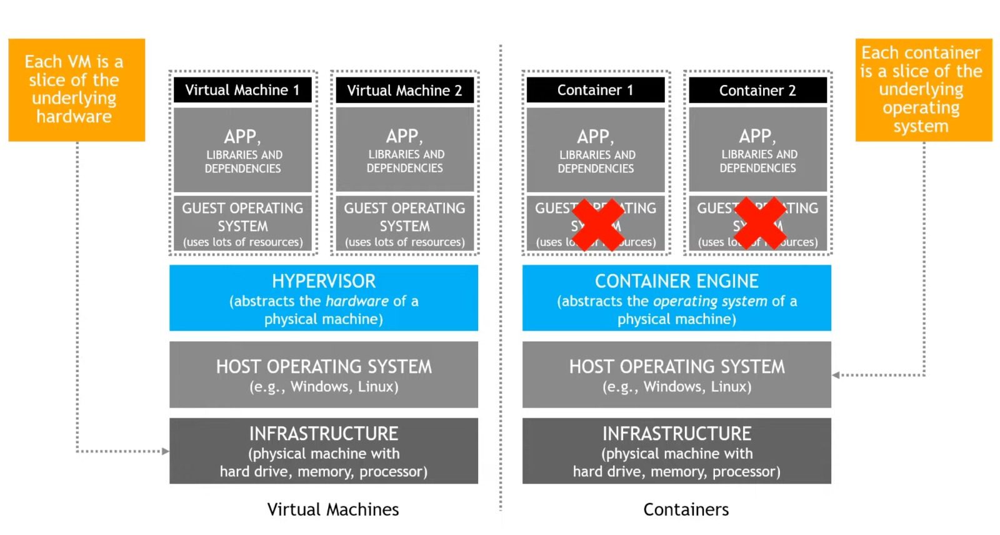
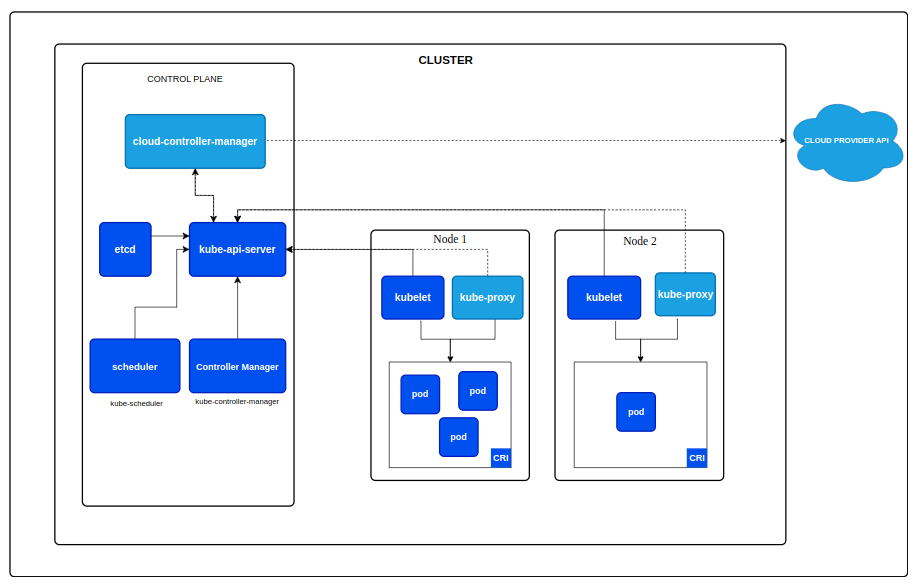
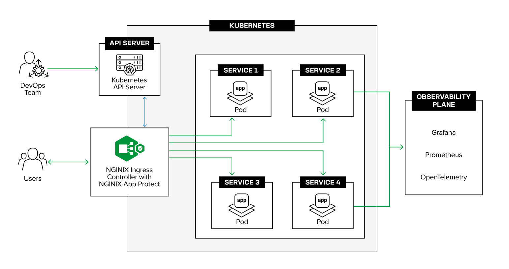

# k8s

## Kubernetes documentation

- [https://kubernetes.io](https://kubernetes.io/docs/concepts/overview/components/)


## Kubernetes Infrastructure
- aws
    - [1 (or more) node cluster with ec2 vm](./infrastructure/aws/ec2-vm/README.md)
    - [1 (or more) node cluster with ec2 public vm](./infrastructure/aws/ec2-public-vm/README.md)
    - [eks](./.docs/eks.md)
- azure
    - [azure vm]()
    - [aks]()
- gcp
    - [gcp vm]()
    - [gke]()
- [kind cluster](https://github.com/samitkumarpatel/kind-k8s-cluster/tree/main)

## Kubernetes Installation

Get the reference from Kubernetes official documents 

prerequisites
    
- Container Runtime (docker or docker-engine is just one. There are many like *CRI-O*, *containerd*, *docker engine* and etc ...
- kubeadm
- kubelet
- kubectl

## Kubernetes Administration
- [cri & kubernetes tools insllation tips](./.docs/kubernetes-1-31-installation.v2.md).
- [Container Runtime Interface | cri](https://kubernetes.io/docs/setup/production-environment/container-runtimes/)
    - [containerd](https://github.com/containerd/containerd/blob/main/docs/getting-started.md)
    - [CRI-O](https://cri-o.io/)
    - Docker Engine
        - [docker engine](https://docs.docker.com/engine/install/ubuntu/).
        - [cri-dockerd](https://mirantis.github.io/cri-dockerd/usage/install/).
    - [Mirantis Container Runtime]()
- [Container Network Interface | cni](https://github.com/containernetworking/cni)

- [User & RBAC](./.docs/README-user-rbac.md).
- [kubeconfig](./.docs/README-kube-config.md).
- Debugging Inside cluster.
    - [shopd](https://github.com/jpetazzo/shpod)
    
    - alpine
    ```sh
    kubectl run alpine --image=alpine -it
    # apk update
    # apk add bind-tools curl wget
    # host service-name # to see the attached dns record

    kubectl run pod -it --image=curlimages/curl -- sh
    ```
- Tools / Operator
  - Helm
  - Kustomize
  - Hashicorp Vault
      - Bank Vault     


## Ingress Controller

- [Supported Kubernetes Ingress Class](https://kubernetes.io/docs/concepts/services-networking/ingress-controllers/).
    - nginx
        - [nginx.org](./.docs/README-nginx-ingress.md)
        - [Kubernetes nginx](./.docs/README-nginx-ingress.md#nginx-ingress-controller-by-kubernetes)
    - [HA / haproxy]()
    - [traefik]()
- Example's
    - [ingress-resources-example](https://github.com/nginx/kubernetes-ingress/tree/main/examples/ingress-resources)

## Operators
- [bank-vault](https://bank-vaults.dev/)

## Container vs VM


## Kubernetes Components Overview**


---

Cluster Component



---

Ingress Controller




## cka

- [cka](./.docs/README-cka.md)

## ckd

- [ckd](./.docs/README-ckd.md)
