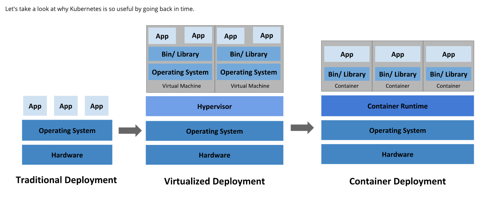
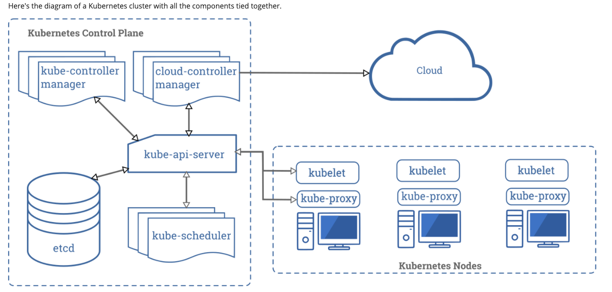

# Kubernetes (k8s)

There are many ways we can spunup a k8s cluster for our development/learning purpose. some of the helpful links are listed below
- [minikube](https://minikube.sigs.k8s.io/docs/)
- [kind](https://kind.sigs.k8s.io/docs/user/quick-start/)
- or use any cloud provider like aks, eks and etc..

In this repository we have a terraform script, which help you to create a k8s cluster in aks and can be found in `infrastructure` folder.

### Quick Knowledge base on k8s
(most of the description, defination, images are taken from [k8s official docs](https://kubernetes.io/docs/home/) )

Kubernetes is a portable, extensible, open-source platform for managing containerized workloads and services, that facilitates both declarative configuration and automation. It has a large, rapidly growing ecosystem. Kubernetes services, support, and tools are widely available

overview , why k8s is popular and useful.

##### Important links

[k8s official documentation](https://kubernetes.io/docs/home/)

[k8s cheat sheet](https://kubernetes.io/docs/reference/kubectl/cheatsheet/)

[k8s workload](https://kubernetes.io/docs/concepts/workloads/)

[pull image from privare registry](https://kubernetes.io/docs/tasks/configure-pod-container/pull-image-private-registry/)

##### k8s componeant

For more details, explore [k8s componeant](https://kubernetes.io/docs/concepts/overview/components/)

**Control Plane Components (master)**

The control plane's components make global decisions about the cluster (for example, scheduling), as well as detecting and responding to cluster events (for example, starting up a new pod when a deployment's replicas field is unsatisfied).

- **kube-apiserver** : The API server is a component of the Kubernetes control plane that exposes the Kubernetes API. The API server is the front end for the Kubernetes control plane
- **etcd** : Consistent and highly-available key value store used as Kubernetes' backing store for all cluster data.
- **kube-scheduler** : Control plane component that watches for newly created Pods with no assigned node, and selects a node for them to run on.
- **kube-controller-manager** : Control Plane component that runs controller processes.
- **cloud-controller-manager** : A Kubernetes control plane component that embeds cloud-specific control logic. The cloud controller manager lets you link your cluster into your cloud provider's API, and separates out the components that interact with that cloud platform from components that just interact with your cluster.

**Node Components**

Node components run on every node, maintaining running pods and providing the Kubernetes runtime environment.

- **kubelet** : An agent that runs on each node in the cluster. It makes sure that containers are running in a Pod.
- **kube-proxy** : kube-proxy is a network proxy that runs on each node in your cluster, implementing part of the Kubernetes Service concept. 
- **Container runtime** : The container runtime is the software that is responsible for running containers.

**Addons** 

Addons use Kubernetes resources (DaemonSet, Deployment, etc) to implement cluster features. Because these are providing cluster-level features, namespaced resources for addons belong within the kube-system namespace.

- DNS
- Web UI (Dashboard)
- Container Resource Monitoring
- Cluster-level Logging

___ 

a nice thing to make use of [shopd](https://github.com/jpetazzo/shpod) while working with k8s. 

