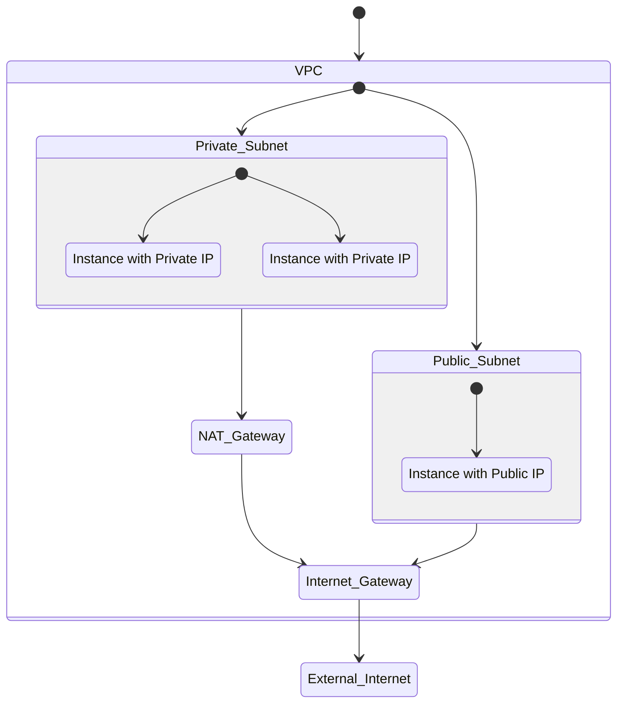

# ec-vm

**Prerequisites**

Ensure `terraform` and `ansible` are installed.

**Folder Structure**

After cloning, your `ec2` folder should look like this:

```sh
├── inventory.yml
├── playbook.yml
├── main.tf
└── README.md
```

**Infrastructure Creation with Terraform**

> On this stage I assume you have aws key and secret configure on your machine or where ever you are trying to run the terrform command.

```sh
# Initialize Terraform:
terraform init

# fmt Terraform
terraform fmt

# Validate the configuration
terraform validate

# Plan and apply the infrastructure:
terraform plan -out plan.out
terraform apply plan.out
```

> Note: With terraform by the help of ansibel provider we are instructing terraform to create a dynamic ansible inventory for us

> Terraform also will create a `ssh key` file for us to be use for `ansible` or `ssh` command.

**Configuration Management with ansible**

> Note: `ansible` need `cloud.terraform` collection to be installed, so that ansible will read the dynamic inventory file generated by terraform state file.

1. Install the required Ansible collection:

```sh
ansible-galaxy collection install cloud.terraform
```

2. View the dynamic inventory content

```sh
ansible-inventory -i inventory.yml --list --vars
```

3. Prepare the SSH key:

```sh
terraform output -raw ssh_key >> id_rsa.pem

chmod 400 id_rsa.pem
```

4. Ping all hosts using Ansible:

```sh
ansible -i inventory.yml all -m ansible.builin.ping
```

5. Install Kubernetes using Ansible

```sh
ansible-playbook -i inventory.yml playbook.yml --syntax-check

ansible-playbook -i inventory.yml playbook.yml
```

**Kubernetes User creation**

[Follow along](../../../.docs/README-user-rbac.md)


**Set Locally install kubectl to remote cluster**

Copy the kubeconfig genrated by above steps to your expected location.

```sh
kubectl --kubeconfig=samit-kubeconfig get pods
kubectl --kubeconfig=samit-kubeconfig get nodes

#OR
export KUBECONFIG=$(pwd)/samit-kubeconfig
kubectl get pods
kubectl getnodes
 
```

**Infrastructure**




[back](../../../README.md)
